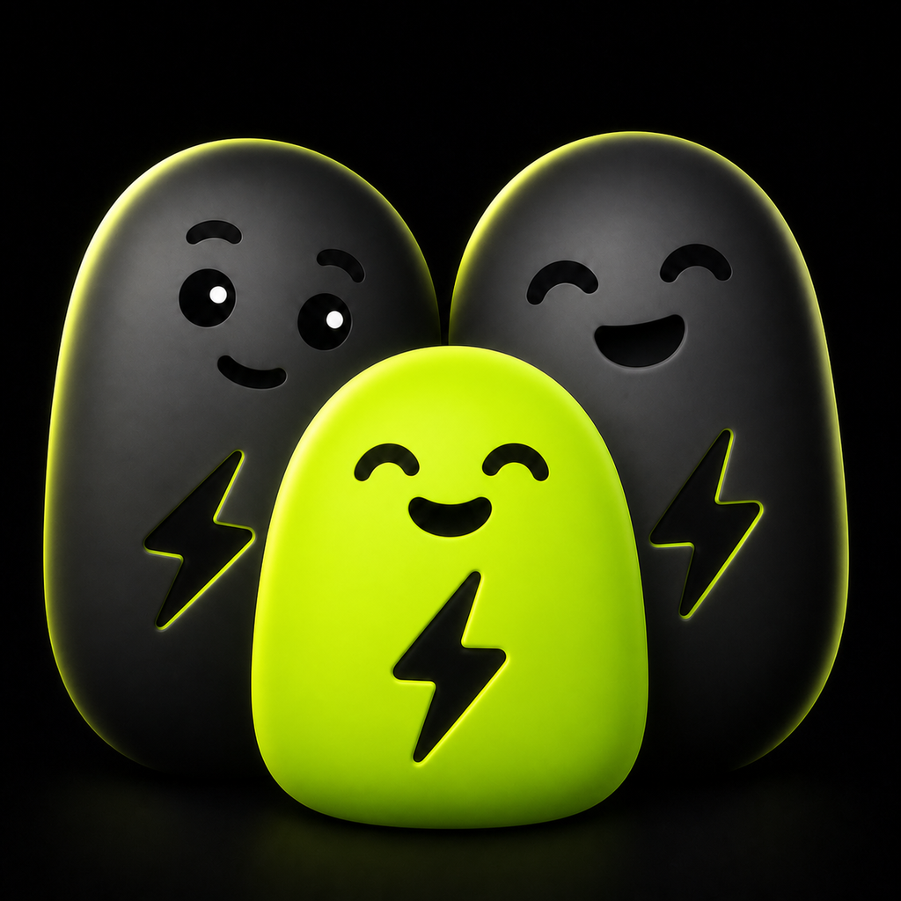
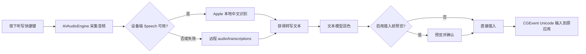

# Flick

<p align="center">
  
</p>

<p align="center">
  一款原生、轻量的 macOS 菜单栏 AI 助手：划词处理、语音听写、AI 润色与跨应用文字插入。
</p>

<p align="center">
  
  
  
  
</p>

Flick 常驻在 macOS 菜单栏中。你可以在任意应用里选中文字，用全局快捷键呼出 AI 浮窗；也可以通过独立的听写快捷键录音，让 Flick 完成语音识别、文本润色，并把结果直接输入回原来的应用。

项目使用 SwiftUI、AppKit、AVFoundation、Speech、Carbon、Core Graphics、Accessibility 与 Security 框架实现，不依赖任何第三方库。

> [!IMPORTANT]
> Flick 需要你自行提供兼容的 API 服务与 API Key。API Key 只保存在当前用户的 macOS 钥匙串中，不会写入项目文件或打包进 App。

## 目录

- [主要功能](#主要功能)
- [工作方式](#工作方式)
- [系统要求](#系统要求)
- [安装](#安装)
- [首次配置](#首次配置)
- [使用划词功能](#使用划词功能)
- [使用语音听写](#使用语音听写)
- [快捷键](#快捷键)
- [API 兼容性](#api-兼容性)
- [Markdown 与思维链](#markdown-与思维链)
- [权限说明](#权限说明)
- [隐私与数据流](#隐私与数据流)
- [从源码构建](#从源码构建)
- [项目架构](#项目架构)
- [配置持久化](#配置持久化)
- [故障排查](#故障排查)
- [发布 DMG](#发布-dmg)
- [贡献](#贡献)
- [许可证](#许可证)

## 主要功能

### 划词 AI 处理

- 在任意 macOS 应用中选中文字，通过全局快捷键呼出浮窗。
- 默认提供解释、总结、翻译为中文、润色和续写提示词。
- 支持创建、编辑、删除及拖拽排序自定义提示词。
- 支持使用数字键 `1`–`9` 快速触发对应位置的提示词。
- 支持直接输入一次性的自定义 Prompt。
- 支持从收藏模型中快速切换当前模型。
- 使用 Server-Sent Events 流式显示回复内容。
- 可选显示模型返回的 reasoning 内容。
- 回复支持 Markdown 排版与一键复制。

### 语音听写

- 支持创建多个独立的听写功能/配置档案。
- 每个听写功能可以分别设置：
  - 功能名称；
  - 全局快捷键；
  - 语音转写模型；
  - 文本润色模型；
  - 润色 System Prompt。
- 普通组合键使用“按住录音、松开结束”的交互。
- `Fn` 可作为独立快捷键，使用“按一次开始、再按一次结束”的交互。
- 优先使用 Apple Speech 框架进行设备端中文识别。
- 设备端识别不可用、失败或超时时，自动回退到远程转写接口。
- 转写结果会通过选定的文本模型进行去口头禅、去重复、纠错和格式整理。
- 可直接插入原应用，也可以先预览确认再插入。
- 支持通过 Unicode 键盘事件输入中文、英文、Emoji 等字符。

### 原生 macOS 体验

- 菜单栏常驻，不显示普通 Dock 主窗口。
- 全局快捷键动态注册，修改设置后自动重新加载。
- 深色黑灰 + 荧光绿界面风格。
- 划词浮窗会出现在鼠标附近，并根据内容调整尺寸。
- 听写过程中显示录音、转写、润色、插入和错误状态浮层。
- API Key 使用 Keychain Services 安全保存。
- 无分析 SDK、无广告 SDK、无第三方依赖。

## 工作方式

### 划词处理流程


Flick 不使用 Accessibility API 直接读取文本内容，而是模拟 `⌘C`，轮询系统剪贴板获取新的字符串，并尽量恢复此前的纯文本剪贴板内容。

### 听写流程



录音会同时转换并保存为 16 kHz、单声道、16-bit PCM WAV 临时文件。任务结束后，临时音频文件会被删除。

## 系统要求

- macOS 15.0 或更高版本。
- 推荐 Apple Silicon Mac。
- 麦克风（使用听写功能时）。
- 可访问所配置 API 服务的网络环境。
- 一个兼容的 API Key。

开发环境：

- 推荐使用项目当前版本对应的 Xcode 26 或更新版本。
- Swift 编译设置由 Xcode 工程管理。
- 不需要 CocoaPods、Carthage 或 Swift Package Manager 依赖。

## 安装

### 从 DMG 安装

1. 从 GitHub Releases 下载最新的 `Flick-<version>.dmg`。
2. 双击 DMG。
3. 将 `Flick.app` 拖入 `Applications`。
4. 启动 Flick。
5. 根据 macOS 提示授予辅助功能、麦克风和语音识别权限。

如果下载的是未经 Apple Developer ID 公证的测试版本，macOS 可能会阻止首次启动。你可以在 Finder 中右键 Flick，选择“打开”，然后再次确认。正式公开发布时建议使用 Developer ID 签名并完成 Apple Notary 公证。

### 从源码运行

```bash
git clone https://github.com/think2do/Flick.git
cd Flick
open Flick.xcodeproj
```

在 Xcode 中选择 `Flick` Scheme 和 `My Mac`，然后按 `⌘R`。

## 首次配置

Flick 启动后只显示菜单栏闪电图标。点击图标并选择“设置…”。

### 通用

填写：

- **API Key**：用于调用你选择的 API 服务；
- **API Base URL**：兼容 OpenAI 风格的 API 根地址。

随后点击“测试连接”。Flick 会调用 `<Base URL>/models` 检查地址与鉴权是否可用。

如果使用 OpenRouter，通用页面还会尝试读取 `<Base URL>/credits` 并显示账户余额。其他服务不会查询余额。

### 划词

1. 从模型库获取服务端模型列表。
2. 添加常用模型。
3. 点击模型行，将其设为当前划词模型。
4. 录制划词快捷键。
5. 根据需要编辑或新增提示词。

自定义提示词中可以使用 `{{text}}` 表示当前选中的文本。例如：

```text
请将下面内容翻译成简洁自然的英文，只输出翻译结果：

{{text}}
```

当提示词不包含 `{{text}}` 时，提示词内容会作为 system message，选中文本会作为 user message。

### 听写

点击“添加听写功能”，为不同场景创建独立配置，例如：

- 日常聊天；
- 工作邮件；
- 会议记录；
- 编程术语；
- 中英混合输入。

每个配置需要填写转写模型和润色模型。当前远程转写实现默认使用类似 `openai/whisper-large-v3` 的模型 ID，具体可用模型取决于你的 API 提供商。

## 使用划词功能

默认快捷键为 `⌘E`。

1. 在备忘录、浏览器、编辑器或其他应用中选中文字。
2. 按 `⌘E`。
3. 在鼠标附近出现的浮窗中选择提示词。
4. 等待流式结果。
5. 点击“复制”，或返回选择其他提示词。

提示词列表支持：

- 鼠标点击；
- 数字键 `1`–`9`；
- 自定义 Prompt 输入框；
- 收藏模型切换；
- reasoning 开关；
- 点击浮窗外区域自动关闭。

## 使用语音听写

### 普通组合键

如果听写配置使用 `⌘⇧D` 等普通组合键：

1. 将光标放在目标应用的输入位置。
2. 按住快捷键并说话。
3. 松开快捷键结束录音。
4. Flick 完成识别与润色。
5. 结果会预览或直接输入回刚才的应用。

### Fn 模式

如果将听写配置设置为单独的 `Fn`：

1. 按一次 `Fn` 开始录音。
2. 再按一次 `Fn` 结束录音。
3. 等待转写、润色和插入。

Flick 使用全局 `flagsChanged` Event Tap 识别 Fn 状态。配置 Fn 后，Flick 会拦截相应 Fn 状态变化，以避免同时触发 Globe/Emoji 等系统行为。

> [!NOTE]
> 当前设备端 Speech locale 固定为 `zh-CN`。专业术语、口音或其他语言识别不理想时，可由远程转写模型回退处理。

## 快捷键

| 功能 | 默认值 | 行为 |
| --- | --- | --- |
| 划词 | `⌘E` | 按下后读取选中文本并显示浮窗 |
| 听写 | `⌘⇧D` | 按住开始录音，松开结束 |
| Fn 听写 | 用户自定义 | 按一次开始，再按一次结束 |

快捷键录制器支持：

- `⌘`、`⌥`、`⌃`、`⇧` 与普通按键组合；
- 方向键、空格、回车、Tab、Delete、Home、End、Page Up/Down；
- `F1`–`F12`；
- 单独的 `Fn`。

划词和听写配置不能使用完全相同的快捷键。多个听写配置之间也会检查冲突。

## API 兼容性

Flick 面向 OpenAI 风格的 HTTP API，但并不意味着所有“兼容服务”的每一个扩展端点都完全相同。

### 必需端点

#### 获取模型

```http
GET /v1/models
Authorization: Bearer <API_KEY>
```

模型列表应返回：

```json
{
  "data": [
    { "id": "provider/model-name" }
  ]
}
```

#### 流式文本处理

```http
POST /v1/chat/completions
Authorization: Bearer <API_KEY>
Content-Type: application/json
```

请求包含：

- `model`；
- `stream: true`；
- `messages`；
- `include_reasoning`；
- 可选的 `reasoning.effort`。

响应需要使用 SSE，并通过 `data: {...}` 返回 `choices[0].delta.content`。如果服务支持 reasoning，Flick 还会读取 `choices[0].delta.reasoning`。

### 远程语音转写端点

```http
POST /v1/audio/transcriptions
Authorization: Bearer <API_KEY>
Content-Type: application/json
```

当前实现发送 JSON：

```json
{
  "model": "openai/whisper-large-v3",
  "input_audio": {
    "data": "<BASE64_WAV>",
    "format": "wav"
  }
}
```

响应需要包含：

```json
{
  "text": "转写结果"
}
```

部分 OpenAI 兼容服务只接受 `multipart/form-data`，不接受上述 JSON 音频格式；这种情况下远程听写会返回 HTTP 400，需要针对该服务调整 `TranscriptionService`。

### Base URL 规则

Flick 会去除 Base URL 末尾的 `/`，并在地址不是以 `/v1` 结尾时自动补上 `/v1`。

常见示例：

| 服务类型 | Base URL 示例 | 说明 |
| --- | --- | --- |
| OpenAI | `https://api.openai.com/v1` | 文本端点兼容；转写模型与请求格式需自行确认 |
| OpenRouter | `https://openrouter.ai/api/v1` | 支持模型列表、文本模型与余额查询；音频端点能力以账户和模型为准 |
| 本地兼容服务 | `http://localhost:1234/v1` | API Key 可根据服务要求填写占位值 |

网络请求使用系统 `URLSession`，会遵循 macOS 的网络和代理设置。请求超时默认为 30 秒，资源总超时为 180 秒；远程转写请求超时为 120 秒。

## Markdown 与思维链

划词结果浮窗支持：

- 一级到六级标题；
- 段落；
- 粗体、斜体、删除线、行内代码及链接；
- 有序列表和无序列表；
- 引用；
- 分隔线；
- 带语言标签的围栏代码块；
- 代码块横向滚动；
- 流式输出时尚未闭合的代码块。

reasoning 开启后，Flick 会向服务发送相关参数，并读取响应中的 `delta.reasoning`。并非所有模型或 API 服务都支持该字段；不支持时通常只会显示最终正文。

“思维链”或 reasoning 内容由上游模型/API 决定。请不要假设它一定代表模型真实、完整或可靠的内部推理过程。

## 权限说明

Flick 会使用以下系统权限：

### 辅助功能

用途：

- 模拟 `⌘C` 获取选中文本；
- 使用 CGEvent 将听写结果输入到其他应用；
- 监听单独的 Fn 键。

路径：

`系统设置 → 隐私与安全性 → 辅助功能`

授权后建议完全退出并重新启动 Flick。

### 麦克风

用途：通过 AVAudioEngine 采集语音。

路径：

`系统设置 → 隐私与安全性 → 麦克风`

### 语音识别

用途：通过 Apple Speech 框架尝试设备端语音识别。

路径：

`系统设置 → 隐私与安全性 → 语音识别`

不同 macOS 版本或系统策略下，还可能显示输入监控相关提示。

## 隐私与数据流

### 本地保存的数据

| 数据 | 保存位置 |
| --- | --- |
| API Key | macOS Keychain，service 为 `com.hyx.ai-assistant` |
| API Base URL | UserDefaults |
| 模型选择与收藏 | UserDefaults |
| 自定义提示词 | UserDefaults（JSON 编码） |
| 快捷键配置 | UserDefaults（JSON 编码） |
| 听写配置与预览选项 | UserDefaults（JSON 编码） |

### 会发送到 API 服务的数据

- 使用划词功能时：选中的文本、提示词、模型名称与 reasoning 设置。
- 使用听写功能时：
  - 如果设备端识别成功，不上传原始音频；
  - 如果设备端识别不可用或失败，WAV 音频会以 Base64 发送到你配置的转写端点；
  - 无论转写来自本地还是远程，转写文本都会发送给你选择的文本模型进行润色。

Flick 当前代码中没有分析、遥测、广告或自有数据上传服务。数据如何被保存和使用，仍取决于你配置的 API 提供商，请阅读对应服务的隐私政策。

### 临时数据

- 录音期间创建临时 WAV 文件；
- 完成或失败后自动尝试删除；
- 划词时临时读取系统剪贴板，并恢复此前的纯文本内容。

> [!WARNING]
> 剪贴板恢复逻辑目前只保存和恢复纯文本。如果原剪贴板包含图片、富文本或文件等其他类型，模拟复制可能改变这些内容。

## 从源码构建

### Xcode

```bash
git clone https://github.com/think2do/Flick.git
cd Flick
open Flick.xcodeproj
```

然后：

1. 选择 Flick Target。
2. 打开 `Signing & Capabilities`。
3. 选择你自己的 Development Team。
4. 如有需要，将 Bundle Identifier 改成你自己的唯一标识。
5. 选择 `My Mac` 并运行。

### 命令行 Debug 构建

```bash
xcodebuild \
  -project Flick.xcodeproj \
  -scheme Flick \
  -configuration Debug \
  -derivedDataPath /tmp/FlickDerivedData \
  build
```

### 不签名的 Release 构建

```bash
xcodebuild \
  -project Flick.xcodeproj \
  -scheme Flick \
  -configuration Release \
  -derivedDataPath /tmp/FlickReleaseDerivedData \
  CODE_SIGNING_ALLOWED=NO \
  build
```

构建结果通常位于：

```text
/tmp/FlickReleaseDerivedData/Build/Products/Release/Flick.app
```

## 项目架构

```text
Flick/
├── Flick.xcodeproj/
├── Flick/
│   ├── FlickApp.swift
│   ├── ContentView.swift
│   ├── AppDelegate.swift
│   ├── GlobalHotkeyManager.swift
│   ├── SelectionReader.swift
│   ├── AIService.swift
│   ├── FloatingPanelController.swift
│   ├── PresetPromptView.swift
│   ├── SettingsManager.swift
│   ├── SettingsView.swift
│   ├── KeychainHelper.swift
│   ├── VoiceDictation/
│   │   ├── AudioRecorder.swift
│   │   ├── LocalSpeechTranscriber.swift
│   │   ├── TranscriptionService.swift
│   │   ├── VoiceDictationCoordinator.swift
│   │   ├── VoiceStatusOverlay.swift
│   │   └── TextInjector.swift
│   ├── Assets.xcassets/
│   ├── Info.plist
│   └── Flick.entitlements
├── README.md
└── LICENSE
```

### 核心文件职责

| 文件 | 职责 |
| --- | --- |
| `FlickApp.swift` | SwiftUI 应用入口；应用以菜单栏模式运行 |
| `ContentView.swift` | Xcode 模板保留视图；当前菜单栏主流程未使用，可按需删除或改作未来主界面 |
| `AppDelegate.swift` | 生命周期、菜单栏、设置窗口、热键和主要协调器装配 |
| `GlobalHotkeyManager.swift` | Carbon 多热键注册，以及 Fn Event Tap |
| `SelectionReader.swift` | 模拟复制、读取并恢复剪贴板 |
| `AIService.swift` | 鉴权请求、模型列表、余额查询、SSE 流式 Chat Completions |
| `FloatingPanelController.swift` | 创建、定位、缩放和关闭划词 NSPanel |
| `PresetPromptView.swift` | 提示词菜单、模型切换、reasoning、Markdown 结果视图 |
| `SettingsManager.swift` | 全局配置模型、默认值、迁移和持久化 |
| `SettingsView.swift` | 通用、划词、听写设置界面及编辑弹窗 |
| `KeychainHelper.swift` | API Key 的 Keychain 增删改查 |
| `AudioRecorder.swift` | AVAudioEngine 录音、PCM 转换和 WAV 写入 |
| `LocalSpeechTranscriber.swift` | Apple Speech 设备端识别与超时控制 |
| `TranscriptionService.swift` | 远程音频转写请求与错误解析 |
| `VoiceDictationCoordinator.swift` | 听写状态机与录音、识别、润色、预览、插入流程编排 |
| `VoiceStatusOverlay.swift` | 听写状态、错误和结果预览浮层 |
| `TextInjector.swift` | Accessibility 检查及 Unicode CGEvent 输入 |

## 配置持久化

`SettingsManager` 是共享的 `ObservableObject`。除 API Key 外，配置保存在 `UserDefaults.standard` 中。

为了兼容旧版本，听写配置初始化时会尝试读取旧的单热键、转写模型和润色模型字段，并迁移为新的 `VoiceDictationProfile` 数组。

API Base URL 默认值：

```text
https://api.openai.com/v1
```

默认划词模型：

```text
gpt-4o
```

默认远程转写模型：

```text
openai/whisper-large-v3
```

这些只是初始值，是否可用取决于实际 API 提供商。

## 故障排查

### 菜单栏没有出现 Flick

- 确认 App 仍在运行。
- Flick 是 `LSUIElement` 菜单栏应用，不会显示普通主窗口或 Dock 图标。
- 在活动监视器中结束旧实例后重新启动。

### 快捷键没有响应

- 检查系统辅助功能权限。
- 修改权限后完全退出并重新启动 Flick。
- 确认快捷键没有被其他应用或系统功能占用。
- 如果使用 Fn，检查 Globe/Emoji 系统配置及控制台中的 Event Tap 错误。

### 划词浮窗没有出现

- 确保当前应用允许复制选中文本。
- 手动按 `⌘C`，确认剪贴板中确实出现文本。
- 密码框、安全输入区域和部分受保护应用可能拒绝模拟复制。
- Flick 只处理非空字符串。

### API 测试失败

- 确认 API Key 已填写；Keychain 中没有凭据时需要重新输入。
- 确认 Base URL 能形成有效的 `/v1/models` 地址。
- 检查代理、VPN、防火墙和 DNS。
- 检查服务是否接受 `Authorization: Bearer <key>`。
- 在设置页面查看测试连接返回的具体错误。

### HTTP 400

常见原因：

- 模型 ID 不存在或当前账户无权使用；
- 服务不支持 `include_reasoning` 或 `reasoning` 参数；
- 远程转写端点要求 multipart，而不是 Base64 JSON；
- 音频模型不支持 `input_audio` 请求格式；
- Base URL 指向了错误的兼容层。

### 听写失败

- 检查麦克风和语音识别权限。
- 确认系统存在可用输入设备。
- 检查 API Key，因为即使本地转写成功，润色步骤仍需要文本 API。
- 检查听写配置中的转写模型和润色模型。
- 如果本地识别质量不佳，确认远程转写端点可用。

### 文字没有插入目标应用

- 授予辅助功能权限。
- 确认触发听写时目标应用位于前台。
- 某些安全输入框、远程桌面或游戏可能阻止合成键盘事件。
- 开启“插入前预览”，确认前面的转写和润色阶段是否成功。

### OpenRouter 余额无法显示

- 余额查询只在 Base URL 包含 `openrouter.ai` 时启用。
- API Key 必须能访问 `/credits`。
- 余额失败不会阻止文本和听写功能。

## 发布 DMG

下面是一个最小的本地测试包流程。正式公开分发时请使用 Developer ID 签名和 Apple Notary 公证。

```bash
# 1. 构建 Release
xcodebuild \
  -project Flick.xcodeproj \
  -scheme Flick \
  -configuration Release \
  -derivedDataPath /tmp/FlickReleaseDerivedData \
  CODE_SIGNING_ALLOWED=NO \
  build

# 2. 准备 DMG 目录
STAGE="$(mktemp -d /tmp/FlickDMG.XXXXXX)"
ditto \
  /tmp/FlickReleaseDerivedData/Build/Products/Release/Flick.app \
  "$STAGE/Flick.app"
ln -s /Applications "$STAGE/Applications"

# 3. 仅供本地测试的 ad-hoc 签名
codesign --force --deep --sign - \
  --entitlements Flick/Flick.entitlements \
  "$STAGE/Flick.app"

# 4. 创建 DMG
hdiutil create \
  -volname "Flick" \
  -srcfolder "$STAGE" \
  -format UDZO \
  -ov \
  "Flick-0.2.dmg"

# 5. 校验
hdiutil verify "Flick-0.2.dmg"
shasum -a 256 "Flick-0.2.dmg"
```

> [!CAUTION]
> Ad-hoc 签名的 DMG 可能被 Gatekeeper 警告，不适合面向公众发布。正式发布需要 Apple Developer Program、`Developer ID Application` 证书、Hardened Runtime、`notarytool` 和 `stapler`。

## 已知限制

- 当前设备端语音识别 locale 固定为 `zh-CN`。
- 当前远程转写请求使用 Base64 JSON，而不是通用的 multipart 上传格式。
- 选中文本读取依赖模拟复制，不适用于所有安全输入场景。
- 剪贴板只恢复此前的纯文本内容。
- 文本插入使用逐字符 CGEvent，在特别长的文本上可能需要一定时间。
- reasoning、模型列表、余额和音频端点属于提供商能力，不是所有 OpenAI 兼容服务都支持。
- 项目当前没有自动化测试 Target。

## 贡献

欢迎提交 Issue 和 Pull Request。

建议流程：

1. Fork 仓库。
2. 从主分支创建功能分支。
3. 保持模块职责清晰，优先使用原生 macOS API。
4. 不要提交 API Key、证书、Provisioning Profile、`.env` 或个人 Xcode 用户数据。
5. 在至少一个真实的 macOS 输入应用中验证快捷键和文字插入。
6. 提交 Pull Request，并描述测试环境、复现步骤和验证结果。

提交问题时，请提供：

- macOS 版本与 Mac 芯片；
- Flick 版本；
- API 服务类型和模型 ID（不要提供 API Key）；
- 使用的是划词、普通听写快捷键还是 Fn；
- 完整错误信息；
- 可复现步骤。

## 安全提醒

- 不要把 API Key 写进源码、README、Issue、截图或 Git 历史。
- 不要提交 `.p12`、证书、Provisioning Profile 或带密码的配置文件。
- 如果 API Key 曾经进入 Git 历史，仅删除文件并不够，应立即在提供商后台撤销并重新生成。
- 发布前检查 Xcode 工程中的 Development Team、Bundle Identifier 和签名配置是否适合公开仓库。

## 许可证

Flick 使用 [MIT License](LICENSE)。

Copyright (c) 2025 HYX Project.

## 免责声明

Flick 与 OpenAI、OpenRouter、Apple 或其他模型/API 提供商不存在隶属或背书关系。模型输出可能不准确，发送敏感文本或音频前请确认所用 API 服务的隐私政策、数据保留规则和适用条款。
