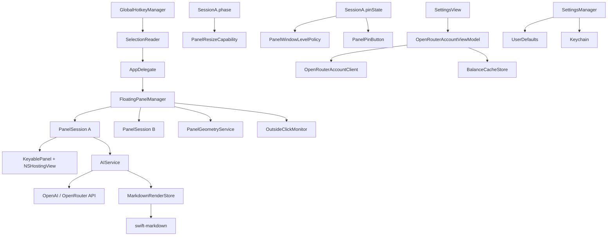

# Architecture

## 模块关系图



## 核心流程

### 1. 应用启动

```swift
@main struct FlickApp  // SwiftUI App
  └─ @NSApplicationDelegateAdaptor AppDelegate
       ├─ NSApp.setActivationPolicy(.accessory)  // 菜单栏应用
       ├─ setupStatusBar()                       // 状态栏图标 + 菜单
       ├─ setupHotkey()                          // Carbon ⌘E 注册
       └─ checkAccessibilityPermission()         // 辅助功能权限检查
```

### 2. 用户唤起浮窗

```text
用户按下 ⌘E
  → GlobalHotkeyManager Carbon callback
    → AppDelegate.handleHotkeyTriggered()
      → SelectionReader.getSelectedText()  // 模拟 ⌘C 读取
        → FloatingPanelManager.show(at:with:)
          → 创建 PanelSession (含独立 AIService)
          → 创建 FloatingPanelController (含 KeyablePanel)
          → CascadePlacementService 计算新窗口位置
          → panel.makeKeyAndOrderFront()
```

### 3. AI 流式回复

```text
用户点击提示词
  → PresetPromptView.triggerPrompt()
    → onPhaseChange(.response)        // 窗口切换到回复模式
    → AIService.sendRequest()
      → cancel() 取消旧任务
      → isLoading = true
      → Task { streamChat() }
        → URLRequest POST /chat/completions (stream: true)
        → SSE 行流处理:
          for try await line in bytes.lines:
            → 解析 delta.content / delta.reasoning
            → await MainActor.run 更新 responseText/reasoningText
            → PresetPromptView.onChange(of: aiService.responseText)
              → MarkdownRenderStore.update(source:)
                  → 75ms 节流后后台解析 Markdown
                  → 发布 snapshot
            → 如果 scrollCoordinator.shouldFollowNewContent
              → proxy.scrollTo("bottom")
        → [DONE] 或流结束
        → isLoading = false
        → MarkdownRenderStore.finish()  // 最终解析
```

### 4. 多窗口固定

```text
窗口 A 固定 (pinState = .pinned)
  → PanelWindowLevelPolicy: window.level = .floating
  → OutsideClickMonitor 跳过该窗口

用户再次按 ⌘E
  → FloatingPanelManager 创建新 PanelSession B
  → CascadePlacementService 计算不与 A 重叠的位置
  → 窗口 B 显示，独立于 A

用户点击窗口外部
  → OutsideClickMonitor 回调
    → FloatingPanelManager.processOutsideClick()
      → 只关闭 pinState == .unpinned 的窗口
```

### 5. 窗口尺寸约束

```text
窗口尺寸变化 (拖拽缩放 / 移动 / 屏幕变化)
  → windowDidEndLiveResize / windowDidMove / screenParametersDidChange
    → PanelGeometryService.constrainedFrame()
      → 最小尺寸: 380 × 360 pt
      → 理论最大: 1_900 × 1_800 pt (最小值的五倍)
      → 实际最大: min(理论, 屏幕 visibleFrame)
      → 位置约束在 visibleFrame 内
    → panel.setFrame(correctedFrame)
    → sizePersistence.recordUserResize()  // 仅记录回复阶段手动缩放
```

## 状态管理

### AIService 状态

| @Published 属性 | 含义 |
|---|---|
| `responseText` | 已累积的回复内容 |
| `reasoningText` | 已累积的推理内容（如开启推理模式） |
| `isLoading` | 请求是否进行中 |
| `isReasoning` | 是否正在接收推理内容 |
| `errorMessage` | 错误信息（成功时为 nil） |

### PanelSession 状态

| @Published 属性 | 含义 |
|---|---|
| `phase` | `.promptList` 或 `.response` |
| `pinState` | `.unpinned` 或 `.pinned` |

### MarkdownRenderStore 状态

| @Published 属性 | 含义 |
|---|---|
| `snapshot.source` | 已解析的源文本 |
| `snapshot.topLevelBlockCount` | 顶层块级节点数 |
| `snapshot.isFinal` | 是否为最终版本 |
| `snapshot.presentationMode` | `.markdown` 或 `.plainText` |

### OpenRouterAccountState 状态

| 字段 | 含义 |
|---|---|
| `connection` | `.idle` / `.loading` / `.connected` / `.disconnected(message:)` |
| `balance` | 余额快照（金额 + 更新时间 + 作用域） |
| `isStale` | 当前数据是否为历史缓存 |
| `balanceErrorMessage` | 余额获取错误信息 |

## 持久化设计

| 数据 | 存储位置 | 键/方式 |
|---|---|---|
| API Key | Keychain | `apiKey` |
| API Base URL | UserDefaults | `apiBaseURL` |
| Model Name | UserDefaults | `modelName` |
| Enable Reasoning | UserDefaults | `enableReasoning` |
| Favorite Models | UserDefaults | `favoriteModels` |
| Custom Prompts | UserDefaults | `customPrompts` (JSON) |
| Hotkey Config | UserDefaults | `hotkeyConfig` (JSON) |
| Response Panel Width | UserDefaults | `responsePanelWidth` |
| Response Panel Height | UserDefaults | `responsePanelHeight` |
| Balance Amount Cache | UserDefaults | `openRouterBalanceAmount` |
| Balance Update Time | UserDefaults | `openRouterBalanceUpdatedAt` |
| Balance Scope | UserDefaults | `openRouterBalanceScope` |

### 不持久化的数据

- 窗口位置（每次从鼠标位置开始）
- 固定状态（每次重新创建时默认为 unpinned）
- AI 回复内容（会话级内存）
- Markdown 语法树（会话级内存）
