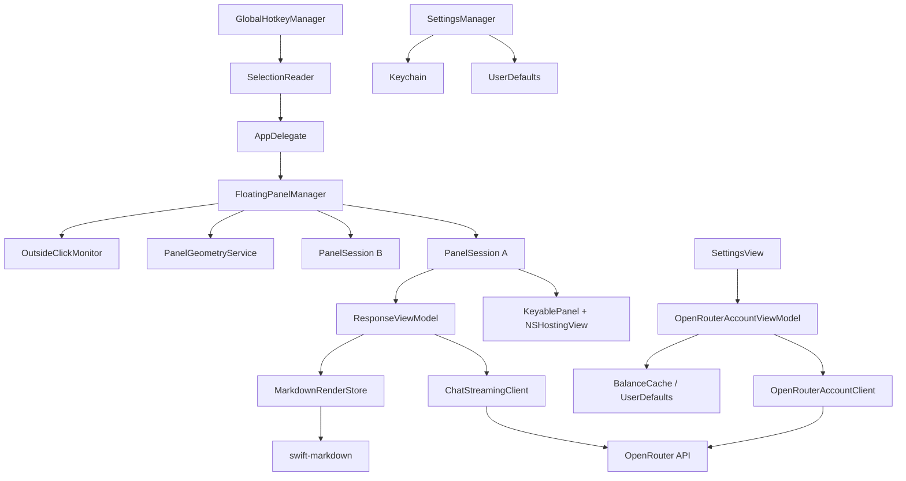

# Flick OpenRouter 分支技术方案

## 1. 文档信息

- 依据文档：[需求说明.md](./需求说明.md)
- 适用分支：`OpenRoter_build`
- 文档状态：技术设计稿
- 目标平台：macOS
- 实现状态：技术方案已实施并验证

> 本文档描述已实施的技术方案。产品已确认：最低支持 macOS 26；不提供"恢复默认窗口大小"；余额使用美元符号 `$`；API Key 为空时显示配置提醒。

## 2. 已核实的现有技术基线

以下内容来自当前工程文件和 Swift 源码：

- 开发语言：Swift。
- UI：SwiftUI 与 AppKit 混合。
- 工程类型：原生 macOS Xcode 工程。
- Swift 编译设置：`SWIFT_VERSION = 5.0`。
- 当前工程部署目标设置：`MACOSX_DEPLOYMENT_TARGET = 26.5`。
- 当前工程没有声明 Swift Package 依赖。
- 浮窗由 `NSPanel` 承载，内容由 `NSHostingView` 加载 SwiftUI 页面。
- AI 请求使用 `URLSession` 和 Swift Concurrency，以 SSE 行流读取 `/chat/completions`。
- 普通设置使用 `UserDefaults`，API Key 使用 macOS Keychain。
- 当前 `FloatingPanelController` 只持有一个 `panel`，每次显示新浮窗前会关闭旧浮窗。
- 当前外部点击监听由 `NSEvent.addGlobalMonitorForEvents` 实现。
- 当前 Markdown 仅使用 `Text(LocalizedStringKey(text))`，不具备稳定的块级渲染、代码块独立复制和流式未闭合语法控制。

### 已确认的部署基线

正式最低支持版本为 macOS 26。工程部署目标和 README 应统一为 macOS 26；当前工程中的 `26.5` 和 README 中的 `15.0+` 均需在 T01 中修正。

## 3. 技术选型

### 3.1 编程语言：Swift

继续使用 Swift，不引入第二种业务语言。

原因：

- 当前项目全部使用 Swift。
- 可直接使用 Swift Concurrency、SwiftUI、AppKit、Security 和 Foundation。
- 浮窗、全局快捷键、剪贴板及屏幕边界都依赖 macOS 原生 API。
- 避免引入 Web 前端运行时和跨语言通信层。

### 3.2 UI 框架：SwiftUI + AppKit

#### SwiftUI 负责

- 提示词列表和 AI 回复页面。
- Markdown 内容块及代码复制按钮。
- 固定图标、连接状态和余额状态。
- 加载、错误、旧数据等响应式状态展示。

#### AppKit 负责

- `NSPanel` 的创建、层级、移动、缩放和屏幕边界。
- 多结果窗口生命周期。
- 鼠标外部点击监听。
- 跨显示器定位。
- `NSHostingView` 与 SwiftUI 内容的桥接。

选择原因：

- SwiftUI 适合根据流式数据和连接状态刷新界面。
- 置顶层级、窗口约束、多窗口管理和精确缩放仍由 AppKit 控制更直接。
- 沿用现有混合架构，改动范围比重写为纯 AppKit 或引入 WebView 更小。

### 3.3 Markdown 解析：`swift-markdown` + 自定义 SwiftUI 渲染器

建议通过 Swift Package Manager 引入：

```text
https://github.com/swiftlang/swift-markdown
```

使用 `swift-markdown` 将完整或可解析的 Markdown 源文解析为语法树，再由项目内的 `MarkdownRenderer` 将受支持节点转换为 SwiftUI 视图。

选择原因：

- `swift-markdown` 专注于解析、构建和分析 Markdown 文档，并提供结构化语法树。
- 自定义渲染器可以严格限制第一版支持范围，不自动启用图片、表格、HTML、数学公式等需求外功能。
- 可以为代码块插入项目自有的“复制代码”按钮。
- 可以控制未闭合 Markdown 的降级策略。
- 可以统一 Flick 的字号、颜色、间距和磨砂浮窗风格。
- 解析层和展示层分离，便于对流式解析和节点渲染分别测试。

未选择完整的第三方 Markdown UI 组件，主要原因是：

- 需求需要自定义代码块复制、流式降级及用户滚动优先逻辑。
- 截至本文核验时，`swift-markdown-ui` 官方仓库已标注为维护模式；不建议将本轮核心阅读能力建立在维护模式组件上。
- 直接采用完整 UI 组件会带入图片、表格等本轮明确不做的能力，并减少对块级交互的控制。

#### 支持节点

- `Heading`
- `Paragraph`
- `Strong`
- `Emphasis`
- `Strikethrough`
- `UnorderedList`
- `OrderedList`
- `BlockQuote`
- `ThematicBreak`
- `InlineCode`
- `CodeBlock`
- `Link`
- 普通文本与软换行

#### 不支持节点

遇到表格、图片、HTML、脚注或其他扩展节点时，转换为可读的纯文本，不发起图片加载，也不执行 HTML。

### 3.4 流式 Markdown 策略：节流解析 + 安全降级

不建议每收到一个字符就同步重建完整视图。建议采用以下策略：

1. `AIService` 继续累积原始 `responseText`。
2. `MarkdownRenderStore` 接收文本变化。
3. 在主线程外进行短间隔节流解析，例如每 `50–100 ms` 最多解析一次。
4. 解析成功后在主线程更新渲染节点。
5. 对未闭合的块级标记保留为普通文本；后续文本补齐后重新解析并替换为正式节点。
6. 回复完成时强制执行一次最终解析。

具体节流间隔属于性能参数，应通过实际流式输出测试确定，不能仅凭文档固定。

### 3.5 自动滚动：SwiftUI `ScrollView` + 用户滚动状态

新增 `ResponseScrollCoordinator`，维护：

```swift
enum AutoScrollState {
    case followingBottom
    case userBrowsing
}
```

规则：

- 初始状态为 `followingBottom`。
- 用户滚动离开底部阈值后切换为 `userBrowsing`。
- `userBrowsing` 状态下，流式内容更新不得调用 `scrollTo("bottom")`。
- 用户重新滚动到底部后切回 `followingBottom`。
- 到底判定使用一个小的像素阈值，避免浮点误差导致状态频繁切换。

SwiftUI 对 macOS 滚动位置监听的具体 API 取决于最终最低系统版本。实现前需要先解决部署目标问题，再决定使用较新的原生滚动几何 API，或通过 `NSScrollView` 桥接读取滚动位置。

### 3.6 窗口系统：自定义 `NSPanel` + 多窗口管理器

继续使用 `NSPanel`，但将单窗口控制器重构为：

- `FloatingPanelManager`：管理所有活动浮窗。
- `PanelSession`：表示一个独立浮窗及其 AI 会话。
- `KeyablePanel`：负责窗口能力和缩放事件。
- `PanelGeometryService`：处理尺寸、位置和屏幕约束。

不建议继续让控制器只持有单个 `panel`，因为固定窗口与新结果窗口必须并存。

#### 窗口样式

提示词列表阶段：

- 固定紧凑尺寸。
- 不允许用户缩放。
- 保持现有外部点击关闭逻辑。

AI 回复阶段：

- 增加可缩放能力。
- 最小尺寸：`380 × 360 pt`。
- 理论最大尺寸：`1900 × 1800 pt`。
- 实际最大尺寸取理论上限与当前屏幕 `visibleFrame` 的交集。
- 使用 `contentMinSize`、`contentMaxSize` 和窗口代理共同约束。

#### 固定状态

每个 `PanelSession` 独立维护：

```swift
enum PinState {
    case unpinned
    case pinned
}
```

- `unpinned`：外部点击可关闭。
- `pinned`：忽略外部点击关闭，窗口层级高于普通窗口。
- 取消固定：窗口继续显示，下一次外部点击才关闭。
- 固定状态不写入持久化存储。

#### 多窗口

- 每次全局快捷键触发都创建新的 `PanelSession`。
- 已固定会话不被新请求关闭或复用。
- 每个会话创建独立 `AIService`，避免流式文本、取消任务和错误状态串线。
- 暂不设置产品层面的固定窗口数量上限。
- 新窗口与现有窗口重叠时，按固定偏移量尝试错开；到达屏幕边缘后在可见区域内重新寻找位置。

#### 外部点击监听

不应为每个窗口各自创建互相不知情的全局监听器，否则一次点击可能误关闭其他会话。

建议由 `FloatingPanelManager` 统一持有一个全局鼠标监听器：

1. 获取点击位置。
2. 判断点击命中了哪个 Flick 窗口。
3. 对所有未固定、且未命中的普通浮窗执行关闭规则。
4. 固定窗口不受影响。
5. 取消固定后的窗口从下一次外部点击开始参与关闭判断。

### 3.7 屏幕约束：`NSScreen.visibleFrame`

使用 `NSScreen.visibleFrame` 而非完整 `frame`，避开菜单栏和 Dock。

`PanelGeometryService` 提供：

- `clampSize(_:to:)`
- `clampOrigin(_:panelSize:screen:)`
- `screenContainingMostOf(_:)`
- `nextCascadedOrigin(from:occupiedFrames:on:)`

窗口移动或缩放结束后再次执行约束。跨显示器时，以窗口面积占比最大的屏幕作为当前屏幕。

### 3.8 网络：Foundation `URLSession` + async/await

继续使用现有 `URLSession` 和 Swift Concurrency，不增加网络库。

原因：

- 当前聊天、模型列表和余额请求已基于 `URLSession`。
- SSE 行流可继续使用 `URLSession.AsyncBytes.lines`。
- 本轮不需要复杂的请求拦截器或通用网络框架。

建议将现有静态方法拆分为：

- `ChatStreamingClient`
- `OpenRouterAccountClient`
- `ModelCatalogClient`

这样余额刷新、服务连接状态和聊天流不会继续集中在单一 `AIService` 中。

#### OpenRouter 服务连接状态

建议将“连接成功”定义为：

- 当前配置识别为 OpenRouter；
- API Key 非空；
- 使用当前配置发出的 OpenRouter 服务探测请求获得有效 HTTP 响应；
- 余额请求成功并返回可解析数据。

如果产品希望连接状态独立于余额接口，应使用轻量级服务端点进行探测。具体端点必须在实现阶段依据 OpenRouter 当时的官方 API 文档实时核验，本文不伪造端点。

### 3.9 持久化：UserDefaults + Keychain

本轮不需要关系型数据库、Core Data 或 SwiftData。

使用：

- Keychain：API Key。
- UserDefaults：普通配置、窗口尺寸、余额缓存和刷新时间。
- 内存：固定状态、窗口位置、连接请求状态、Markdown 解析状态和 AI 回复内容。

原因：

- 数据量很小，不需要查询、关联或迁移复杂表结构。
- UserDefaults 足以存储少量配置和缓存。
- API Key 必须继续存储在 Keychain。
- 需求明确不持久化窗口位置、固定状态和回复内容。
- 不提供恢复默认窗口大小的入口。

## 4. 架构划分

### 4.1 模块关系图



### 4.2 模块职责

#### `AppDelegate`

- 应用生命周期。
- 菜单栏与设置窗口。
- 接收全局快捷键结果。
- 将选中文本交给 `FloatingPanelManager`。

#### `FloatingPanelManager`

- 创建、注册和销毁 `PanelSession`。
- 支持多个固定窗口并存。
- 统一处理外部点击。
- 负责新窗口错开排列。
- 不直接持有 AI 回复业务状态。

#### `PanelSession`

- 一个浮窗对应一个会话。
- 持有唯一会话 ID、`NSPanel`、`ResponseViewModel` 和 `AIService`/聊天客户端。
- 管理当前页面、固定状态和当前几何信息。
- 关闭时取消自身未完成任务并释放监听关系。

#### `PanelGeometryService`

- 计算提示词列表固定尺寸。
- 恢复 AI 回复保存尺寸。
- 应用最小值、五倍最大值和屏幕限制。
- 处理跨显示器移动。
- 为新窗口计算错开位置。

#### `ResponseViewModel`

- 组织当前会话的回复、推理、错误和加载状态。
- 将流式原文交给 `MarkdownRenderStore`。
- 维护自动滚动状态。
- 处理复制整段回复和复制单个代码块。

#### `MarkdownRenderStore`

- 对流式文本进行节流解析。
- 保存最近一次原始文本和渲染节点。
- 将未闭合部分降级为普通文本。
- 回复结束时进行最终解析。

#### `MarkdownRenderer`

- 将允许的 Markdown 节点转换为 SwiftUI 视图。
- 为代码块增加复制按钮。
- 对需求外节点进行纯文本降级。
- 不负责网络或持久化。

#### `OpenRouterAccountViewModel`

- 设置页打开时自动刷新。
- 维护加载、已连接、连接失败和旧数据状态。
- 不提供手动刷新入口。
- 防止旧请求覆盖新配置结果。

#### `OpenRouterAccountClient`

- 请求余额。
- 执行 OpenRouter 服务连接检查。
- 将网络响应转换为明确的数据模型或错误。

#### `SettingsManager`

- 继续管理 API 基础地址、模型、提示词和窗口尺寸。
- 不保存固定状态和窗口位置。
- 不直接发起网络请求。

## 5. 数据流

### 5.1 AI 回复流

1. 用户在其他应用中选中文本并按全局快捷键。
2. `GlobalHotkeyManager` 通知 `AppDelegate`。
3. `SelectionReader` 读取选中文本。
4. `FloatingPanelManager` 创建新的 `PanelSession`。
5. 用户在固定尺寸的提示词列表中选择操作。
6. 会话在结果开始生成前恢复已保存的 AI 回复窗口尺寸。
7. `ResponseViewModel` 调用 `ChatStreamingClient`。
8. OpenRouter SSE 内容写入当前会话的原始 `responseText`。
9. `MarkdownRenderStore` 节流解析原文。
10. `MarkdownRenderer` 更新 SwiftUI 内容。
11. 若用户位于底部，滚动协调器跟随新内容；若用户主动浏览旧内容，则保持当前位置。
12. 回复结束后执行最终解析。

### 5.2 固定与多窗口流

1. 用户点击当前结果右上角固定图标。
2. 当前 `PanelSession.pinState` 变为 `pinned`。
3. `FloatingPanelManager` 的外部点击处理跳过该会话。
4. 用户再次触发全局快捷键。
5. 管理器创建新的独立 `PanelSession`。
6. 几何服务根据已有窗口位置计算错开位置。
7. 两个会话分别维护自己的请求、内容、尺寸和固定状态。
8. 用户取消固定后，该窗口继续显示，并在下一次外部点击时关闭。

### 5.3 余额与连接状态流

1. 用户打开设置窗口。
2. `SettingsView` 触发 `OpenRouterAccountViewModel.refreshOnOpen()`。
3. ViewModel 检查当前地址是否属于 OpenRouter。
4. 非 OpenRouter：整个账户区域隐藏，不发请求。
5. OpenRouter 且 Key 可用：异步检查服务连接并请求余额。
6. 成功：更新余额、成功状态和刷新时间，并写入缓存。
7. 失败且有缓存：显示旧余额、相对时间、“旧数据”和连接失败状态。
8. 失败且无缓存：只显示连接失败，不伪造余额。
9. API Key 为空：显示“请先配置 API Key”，不发起账户请求。
10. 余额金额使用美元符号 `$` 并保留两位小数。

## 6. 数据结构与存储草图

### 6.1 持久化数据

本项目不使用数据库表。以下为 UserDefaults/Keychain 的键值结构草图。

| 存储 | Key | 类型 | 用途 |
|---|---|---:|---|
| Keychain | `apiKey` | `String` | OpenRouter/API 凭据 |
| UserDefaults | `apiBaseURL` | `String` | API 基础地址 |
| UserDefaults | `modelName` | `String` | 当前模型 |
| UserDefaults | `customPrompts` | `Data` | JSON 编码的提示词数组 |
| UserDefaults | `enableReasoning` | `Bool` | 推理模式 |
| UserDefaults | `favoriteModels` | `[String]` | 收藏模型 |
| UserDefaults | `hotkeyConfig` | `Data` | JSON 编码的快捷键配置 |
| UserDefaults | `responsePanelWidth` | `Double` | AI 回复窗口宽度 |
| UserDefaults | `responsePanelHeight` | `Double` | AI 回复窗口高度 |
| UserDefaults | `openRouterBalanceAmount` | `Double` | 最近成功余额缓存 |
| UserDefaults | `openRouterBalanceUpdatedAt` | `Date` | 最近成功刷新时间 |
| UserDefaults | `openRouterBalanceScope` | `String` | 缓存对应的配置标识，避免跨账户误用 |

`openRouterBalanceScope` 不应存储完整 API Key。建议使用不会泄露凭据的配置作用域，例如规范化后的主机名与 Key 的不可逆摘要组合。摘要只用于判断缓存归属，不用于认证。

### 6.2 不持久化数据

| 数据 | 生命周期 |
|---|---|
| `PanelSession.id` | 当前进程中的窗口会话 |
| `pinState` | 当前结果浮窗 |
| 窗口位置 | 当前结果浮窗 |
| AI 原始回复 | 当前结果浮窗 |
| Markdown 语法树 | 当前结果浮窗 |
| 自动滚动状态 | 当前结果浮窗 |
| 正在执行的网络任务 | 当前请求 |
| 当前连接加载/失败状态 | 当前设置窗口会话 |

### 6.3 Swift 数据模型草图

```swift
struct ResponsePanelSize: Codable, Equatable {
    var width: CGFloat
    var height: CGFloat
}

struct BalanceSnapshot: Codable, Equatable {
    var availableAmount: Decimal
    var updatedAt: Date
    var scope: String
}

enum OpenRouterConnectionState: Equatable {
    case idle
    case loading
    case connected
    case disconnected(message: String)
}

struct OpenRouterAccountState: Equatable {
    var connection: OpenRouterConnectionState
    var balance: BalanceSnapshot?
    var isStale: Bool
}

@MainActor
final class PanelSession: ObservableObject, Identifiable {
    let id: UUID
    let selectedText: String
    let responseViewModel: ResponseViewModel
    var panel: KeyablePanel?

    @Published var pinState: PinState
    @Published var phase: PanelPhase
}

enum PanelPhase {
    case promptList
    case response
}
```

金额在业务模型中建议使用 `Decimal`，避免后续计算和格式化使用二进制浮点产生显示误差。网络层解析后再转换为 `Decimal`；界面固定显示两位小数。

## 7. 建议的代码文件调整

### 保留并修改

- `AppDelegate.swift`
- `PresetPromptView.swift`
- `FloatingPanelController.swift`：建议重构或替换为管理器。
- `SettingsManager.swift`
- `SettingsView.swift`
- `AIService.swift`：逐步拆分职责。

### 建议新增

```text
Flick/
├── Panels/
│   ├── FloatingPanelManager.swift
│   ├── PanelSession.swift
│   ├── KeyablePanel.swift
│   ├── PanelGeometryService.swift
│   └── OutsideClickMonitor.swift
├── Markdown/
│   ├── MarkdownRenderStore.swift
│   ├── MarkdownRenderer.swift
│   ├── MarkdownBlockView.swift
│   └── ResponseScrollCoordinator.swift
├── Networking/
│   ├── ChatStreamingClient.swift
│   ├── OpenRouterAccountClient.swift
│   └── ModelCatalogClient.swift
├── Account/
│   ├── OpenRouterAccountViewModel.swift
│   └── BalanceSnapshot.swift
└── Storage/
    └── PanelPreferencesStore.swift
```

该目录拆分是建议方案，不要求一次性移动所有现有文件。开发时可先新增关键类型，再逐步迁移，避免大规模机械重构掩盖功能问题。

## 8. 关键实现约束

1. 每个浮窗必须拥有独立 AI 请求对象，不能共享可变的回复状态。
2. 固定窗口不能被新快捷键请求或其他窗口的外部点击监听误关闭。
3. 所有窗口几何变化必须经过同一个边界服务。
4. 提示词列表尺寸和 AI 回复尺寸必须分开管理。
5. Markdown 解析不得在主线程上高频阻塞。
6. 用户滚动状态优先于自动滚动。
7. 复制代码块时只复制代码内容，不包含围栏标记。
8. Markdown 链接点击遵守 macOS 正常外部链接打开行为；不得执行嵌入 HTML 或脚本。
9. 余额缓存必须与当前 API 配置作用域匹配，不能把其他 Key 的余额当作当前数据。
10. 网络错误信息不得包含完整 API Key。

## 9. 测试建议

### 单元测试

- Markdown 支持节点与降级节点。
- 未闭合代码围栏、粗体、链接和列表。
- 代码块复制内容。
- 窗口尺寸最小值、五倍上限和屏幕限制。
- 新窗口错开算法。
- 余额缓存作用域匹配。
- 相对时间格式。
- 旧请求结果不覆盖新配置。

### 集成测试

- 流式回复过程中 Markdown 持续更新。
- 用户滚动离开底部后位置保持稳定。
- 多个固定窗口同时流式输出且互不串线。
- 取消固定后等待下一次外部点击关闭。
- 跨显示器拖动和缩放。
- 打开设置后自动刷新、失败后显示旧数据。

### 手工验收

- 不同尺寸和缩放比例的显示器。
- 菜单栏、Dock 和全屏应用环境。
- 长列表、长代码块和混合 Markdown。
- 快速连续触发全局快捷键。
- OpenRouter Key 有效、无效、为空和网络中断。

## 10. 风险与取舍

### 流式 Markdown 重排

重复解析完整文本可能随回复增长产生性能压力。第一版采用节流解析；如果实测仍有卡顿，再考虑增量语法树或只重建尾部块，不提前增加复杂度。

### 多窗口资源占用

需求暂不限制固定窗口数量，因此每个窗口都可能持有 SwiftUI 树和历史回复。产品没有设置数量上限，但实现仍应在窗口关闭后立即取消任务并释放会话，避免已关闭窗口泄漏。

### 外部点击判定

多窗口后，原有单一全局监听器逻辑不能直接复用。必须集中处理点击位置与各窗口状态，否则可能出现固定窗口被误关或多个普通窗口同时异常关闭。

### OpenRouter 接口变化

当前代码根据 `/credits` 返回的 `total_credits - total_usage` 计算余额。该接口和字段属于可能变化的外部能力，实现前必须以当时 OpenRouter 官方文档或实际响应进行核验；未经核验不能声称当前字段长期稳定。

### 部署目标不一致

最低支持版本已经确定为 macOS 26。T01 需要把工程当前的 `26.5` 和 README 中的 `15.0+` 统一为 macOS 26，再以该基线选择滚动监听和窗口 API。

## 11. 推荐实施顺序

1. 将工程和 README 统一到最低 macOS 26。
2. 引入 `swift-markdown`，完成静态 Markdown 节点渲染和代码块复制。
3. 增加流式节流解析、未闭合降级和滚动优先级。
4. 抽出 `PanelSession` 与 `FloatingPanelManager`，先保证单窗口行为不回退。
5. 实现回复页缩放、尺寸持久化和屏幕约束。
6. 实现固定状态与统一外部点击管理。
7. 实现多固定窗口、新窗口错开和资源释放。
8. 将余额迁移到设置页，增加连接状态与旧数据缓存。
9. 完成单元、集成和多显示器手工验收。

## 12. 外部技术参考

- [Swift Markdown 官方仓库](https://github.com/swiftlang/swift-markdown)：用于核验该包的定位、解析能力和语法树模型。
- [MarkdownUI 官方仓库](https://github.com/gonzalezreal/swift-markdown-ui)：用于核验完整 SwiftUI Markdown 组件的能力及当前维护状态。

项目已通过 Swift Package Manager 正式引入 `swift-markdown`，并锁定为精确版本 `0.8.0`（同时锁定依赖 `swift-cmark 0.8.0`）。`Package.resolved` 已记录对应版本与 revision，不跟随 `main` 分支。

项目使用 `swift-markdown` 将回复内容解析为语法树，再由项目内的自定义渲染器将支持节点转换为 SwiftUI 视图。不支持节点（表格、图片、HTML 等）降级为可读文本展示。
